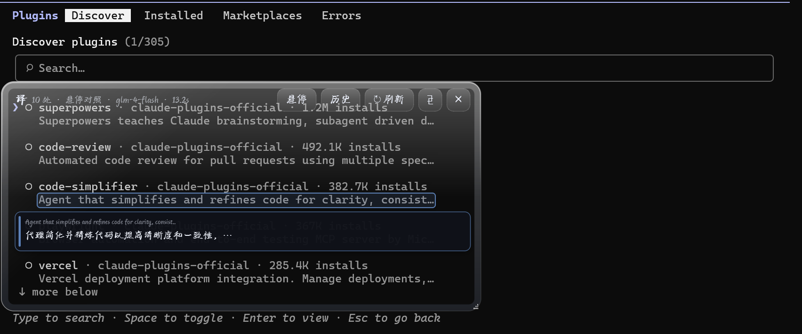
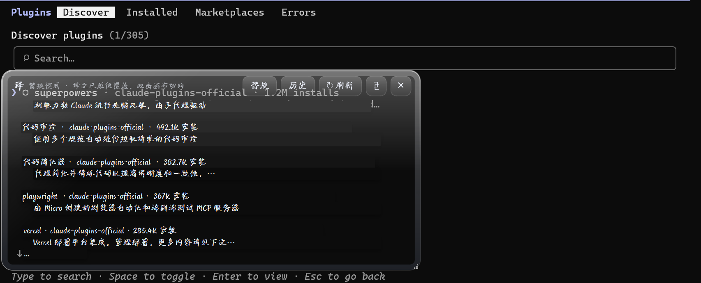

# SnapTrans · 翻译放大镜

浏览器有自带翻译，办公软件有划词翻译——但**终端是翻译的盲区**：命令行工具、AI 编程助手（Claude Code、ZCode CLI…）、各类 TUI 界面里冒出的英文报错和说明，选中复制再贴去网页翻译，思路早就断了。

SnapTrans 用一个液态玻璃放大镜填补这个空缺：**框选屏幕任意区域，OCR 识别后把中文按原文排版原位覆盖**——译文就"长"在终端里，内容变了自动重翻，工作流零中断，其余界面完全不受影响。

## 界面预览

**悬停对照** —— 光标放到句子上，双语气泡自动浮现



**替换模式** —— 译文按原文的位置、字号、配色原位覆盖


**翻译历史** —— 日期分组卡片流，单击复制



## ✨ 功能特性

- **翻译放大镜**：全透明视区实时透视原文，译文按原文的位置、字号、配色原位覆盖，或悬停逐句对照
- **零闪烁截屏**：截屏零窗口状态变化，配合内容变化检测，浮窗不动也能自动重翻
- **流式渐进显示**：译文逐行实时浮现，缓存命中立即出
- **划词翻译**：复制文本按热键即出双语气泡
- **截断感知**：界面省略号截断的文案（如 "man…"）不会臆译成无关词
- **翻译历史**：最近 100 条，日期分组、关键词筛选、单击复制
- **术语表**：自定义词表即时生效，专有名词全篇一致
- **液态玻璃外观**：自绘玻璃卡片，界面与译文统一手写字体（可自定义）
- 开机自启、全局热键、托盘常驻、多显示器适配（per-monitor DPI）

## 🔧 技术要点

整体数据流：

```
全局热键 ──► 画布视区（近乎全透明，实时透视）
                │
                ▼
    截屏（零窗口状态变化）──► RapidOCR（深底自动反色 / 坐标与配色整理）
                │                        │
                │                 文本块坐标 + 中位数配色采样
                ▼                        ▼
    GLM 流式翻译（编号协议 / 行级缓存 / 术语表）──► 逐行原位覆盖渲染
```

### 1. 零闪烁截屏：一条被反复否决的方案链

放大镜必须"看穿"自己截取脚下的内容，又不能让用户察觉任何闪动：

| 方案 | 结果 | 原因 |
|---|---|---|
| 隐藏窗口 → 截屏 → 恢复 | ❌ | 整窗消失又出现，肉眼可见闪烁 |
| `SetWindowOpacity(0)` 归零 | ❌ | 工具条与译文随之隐身，轮询期间周期性闪烁 |
| `WDA_EXCLUDEFROMCAPTURE` | ❌ | 像素级实验：GDI 截屏中该窗口区域呈占位底色，而非透出下层内容 |
| 裸 `BitBlt`（不带 CAPTUREBLT） | ❌ | Win11 DWM 合成下分层窗口仍被摄入画面 |
| **视区近乎全透明 + 截屏零状态变化** | ✅ | 视区仅 ~10% 着色，截屏即底层内容；内容变化由 64×40 灰度指纹对比检测 |

关键取舍：视区保留约 10% 的白色着色（人眼几乎无感），换取 OCR 与变化检测所需的最小对比度，同时实现零闪烁。

### 2. 全透明画布的鼠标穿透

去掉不透明快照后，悬停功能失效了。排查发现是两层叠加的根因：

- **OS 层**：分层窗口 alpha=0 的像素会被 Windows 判为鼠标穿透——真实光标的事件直接落到了底下的应用（用应用级事件探针 + DPI 修正的 `SetCursorPos` 实锤；而合成事件 `sendEvent` 会绕过系统命中测试，恰好掩盖了这一层）。修复：译文块区域填充 alpha≈2/255 的隐形命中区，人眼不可见但可命中；
- **交互层**：光标在翻译进行的数秒内先停在句子上，译文到位后只要不移动鼠标，`mouseMoveEvent` 永远不会触发。修复：行级译文到达时立即用 `QCursor.pos()` 做一次命中测试，气泡自动浮现。

### 3. 混合 DPI 下的坐标系

进程声明 per-monitor DPI aware + PassThrough 缩放策略后，全部坐标以逻辑像素流动，只在两处边界与物理像素换算：截屏裁剪（OCR 输入）与文本块坐标还原（`box / dpr`）。回归测试中以 DPI 修正后的 `SetCursorPos`（逻辑坐标 × 1.5）验证真实光标路径。

### 4. 原位覆盖的排版策略

- **统一字号**：取所有文本块高度中位数 × 0.85，钳制 12~28px——避免逐行自适应导致的参差感；
- **配色复刻**：块内像素中位数 ≈ 背景色（文字笔画是少数派），按亮度选择深/浅前景色；
- **遮罩随译文延展**：中文比原框宽时背景遮罩同步加宽，超宽 25% 以上才逐级缩小该行；
- **截断治理**：省略号变体规范化 → 提示词截断规则 → 译文省略号守卫，三层防止 "man…" 被臆译成 "人"。

### 5. 流式渲染协议

GLM SSE 逐 delta 累积，编号协议每完成一行立即解析回调；行级缓存命中与纯符号行零延迟回调；流结束后整段解析兜底 + 缺失行非流式重试；缓存写入与回调同步完成。渲染侧先建骨架（坐标/配色就绪、译文留空），行级更新到达即逐块重绘。

### 6. 测试方法论

`tests/run_regression.py` 固化了 9 项行为断言：透屏截取纯净度、隐形命中区 alpha、停靠光标自动气泡、DPI 修正的真实光标路径、截断守卫等。核心教训：**合成事件（`sendEvent`）会绕过 OS 命中测试**，凡是涉及窗口穿透与焦点行为的功能，必须用真实光标路径验证——悬停失效正是被合成事件测试掩盖的回归。

## 环境要求

- Windows 10 2004+ / Windows 11（零闪烁截屏与悬停依赖 WDA/透明窗口行为）
- 脚本运行需 Python 3.10+；或直接使用打包好的 exe

## 快速上手（两种方式任选）

- **绿色 exe**：直接双击 `dist\SnapTrans.exe`（无需 Python；config.json / glossary.txt 放在 exe 旁边即可）
- **脚本运行**：双击 `run.bat`（首次先跑 `setup.bat` 装依赖）

程序常驻系统托盘（"译"字图标）。首次运行弹出设置窗口：粘贴[智谱开放平台](https://open.bigmodel.cn)的 API Key，模型默认免费的 GLM-4-Flash。

## 两种翻译方式

**① 翻译放大镜（`Ctrl+Alt+T`）**——浮窗出现在鼠标处，自动翻译它覆盖的区域：

- 拖动/拉伸浮窗，**停稳半秒自动翻译**；浮窗不动、底下内容变化时也会**自动重翻**（托盘"跟随内容变化"开关）
- **流式渐进显示**：译文逐行实时浮现（缓存命中立即出），不必等整段翻完
- **悬停对照（默认）**：浮窗实时透视原文（无冻结画面、无模糊），鼠标移到某句上浮现双语气泡，单击该行只复制该行译文
- **替换模式**：双击画布或点工具栏按钮切换，中文按原文位置/字号/配色整页覆盖
- **零闪烁**：截屏不改变窗口状态（画布本身近乎全透明），轮询检测全程无可感知动静
- `↻ 刷新` 手动重翻；`⧉` 复制全部译文；`✕` 关闭

**② 划词翻译（`Ctrl+Alt+B`）**——复制英文文本后按热键，玻璃气泡显示原文/译文对照，可选中复制。

## 托盘菜单

翻译放大镜 / 剪贴板翻译 / 翻译历史 ｜ 移动后自动翻译 ✓ / 跟随内容变化 ✓ / 开机自启 ✓ ｜ 模型：子菜单可切换 ｜ 打开术语表 / 设置… ｜ 退出

## 翻译历史

托盘"翻译历史"打开玻璃面板：最近 100 条记录（原文+译文+时间），**单击条目复制译文**，可一键清空。数据保存在本机 `history.json`。

## 术语表

项目目录的 `glossary.txt`：每行一条「英文 = 中文」（也支持 `->` 或 Tab），保存**立即生效**，翻译时强制按词表翻译——专有名词全篇一致。托盘"打开术语表"可随时编辑。

## 译文字体

译文字体使用「汉仪小松枝」手写体（公开免费授权，已随仓库附带在 `fonts/汉仪小松枝.ttf`，程序自动加载）。换字体：把新的 .ttf/.otf/.ttc 丢进 `fonts/` 文件夹（exe 模式放在 exe 旁边），并在 config.json 的 `font_family` 填其字族名（或直接写系统中文字体名）；找不到时回退微软雅黑。字号为**全区域统一**（按文本块高度中位数推导，12~28px 自适应），悬停气泡与界面文字同款字体。

## 配置（config.json）

```json
{
  "api_key": "你的智谱 API Key",
  "model": "glm-4-flash",
  "hotkey": "ctrl+alt+t",
  "hotkey_clipboard": "ctrl+alt+b",
  "lens_mode": "hover",
  "font_family": "HYXiaoSongZhi",
  "auto_translate": true,
  "follow_content": true,
  "poll_interval_ms": 1500,
  "change_threshold": 3.0,
  "invert_threshold": 110
}
```

- `lens_mode`：悬停对照（hover）/ 原位替换（replace）
- `poll_interval_ms` / `change_threshold`：内容检测的轮询间隔与灵敏度（灰度平均差阈值，调小更灵敏）

## 打包 exe

改动代码后双击 `build_exe.bat` 重新打包，产物在 `dist\SnapTrans.exe`。

## 已知限制

- 替换模式的译文贴片会盖住对应原文，被贴片覆盖区域的内容变化检测不到（悬停模式无此问题）
- 译文按 OCR 识别的文本块对位，极小字号或特殊字体的识别误差会影响贴片位置
- 翻译内容会上传给智谱 API，介意敏感信息的话避开即可

## 许可证

本项目代码以 [MIT License](LICENSE) 开源。翻译由智谱 AI 提供；`fonts/` 目录下的字体（如有）为用户自行添加，其授权条款归各自版权方所有，不在本仓库分发。

## 项目结构

```
snaptrans/
├── app.py             # 主控制器：热键、托盘、自启、划词翻译
├── lens.py            # 翻译放大镜：无闪烁截屏、变化检测、流式渲染
├── bubble.py          # 划词翻译气泡
├── history.py         # 翻译历史（存储 + 面板）
├── ocr_engine.py      # RapidOCR 封装（深底自动反色、按块整理坐标）
├── translator.py      # GLM 翻译客户端（流式 + 行级缓存 + 术语表）
├── settings_dialog.py # 设置窗口
├── glass.py           # 液态玻璃：自绘玻璃卡片 + QSS
└── config.py          # 配置/术语表路径
tests/run_regression.py  # 行为回归测试（悬停、透屏截取等）
launch.py              # exe 打包与开机自启的入口
```

回归测试：`python tests/run_regression.py`（GUI 项会短暂移动系统光标；请保持屏幕左上区域无遮挡，被遮挡时相关项自动跳过）。
